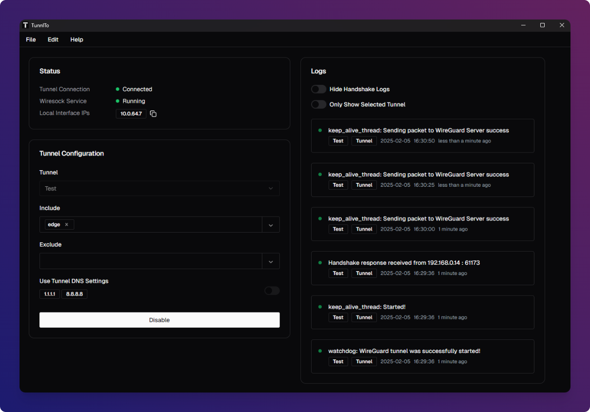
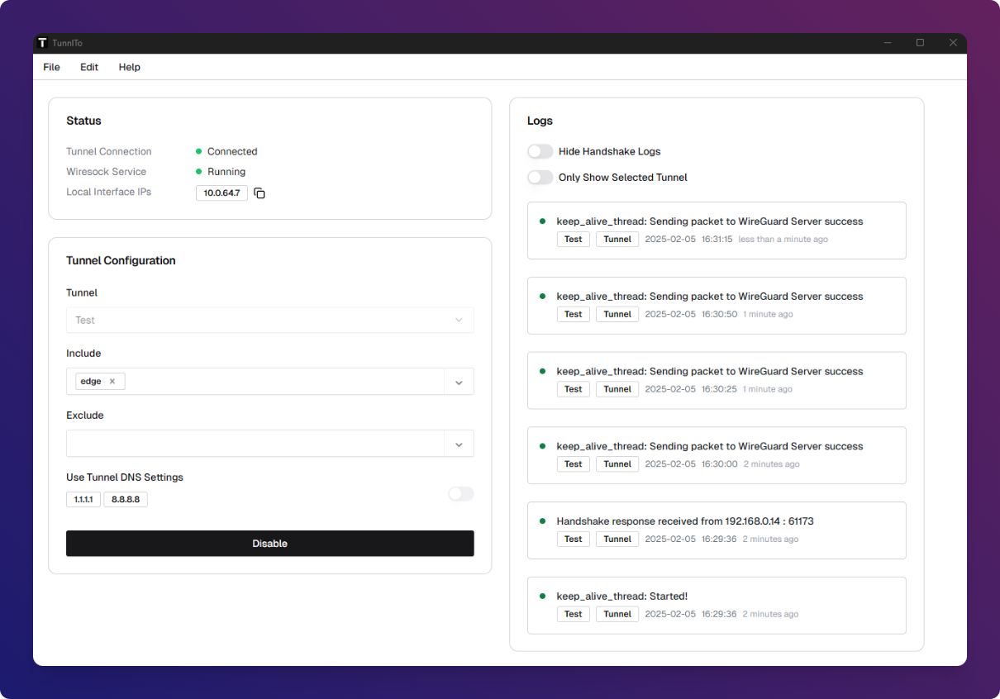
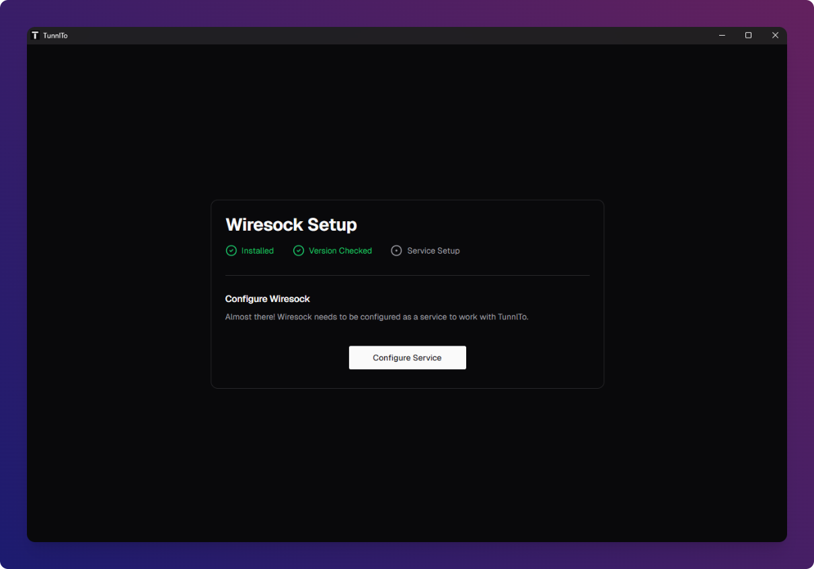
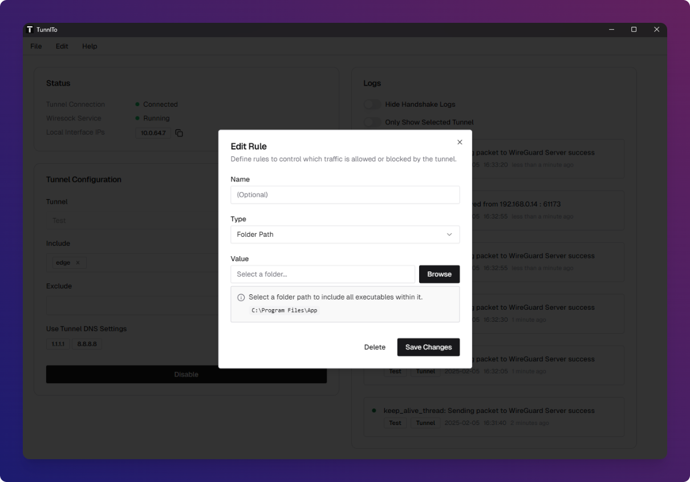
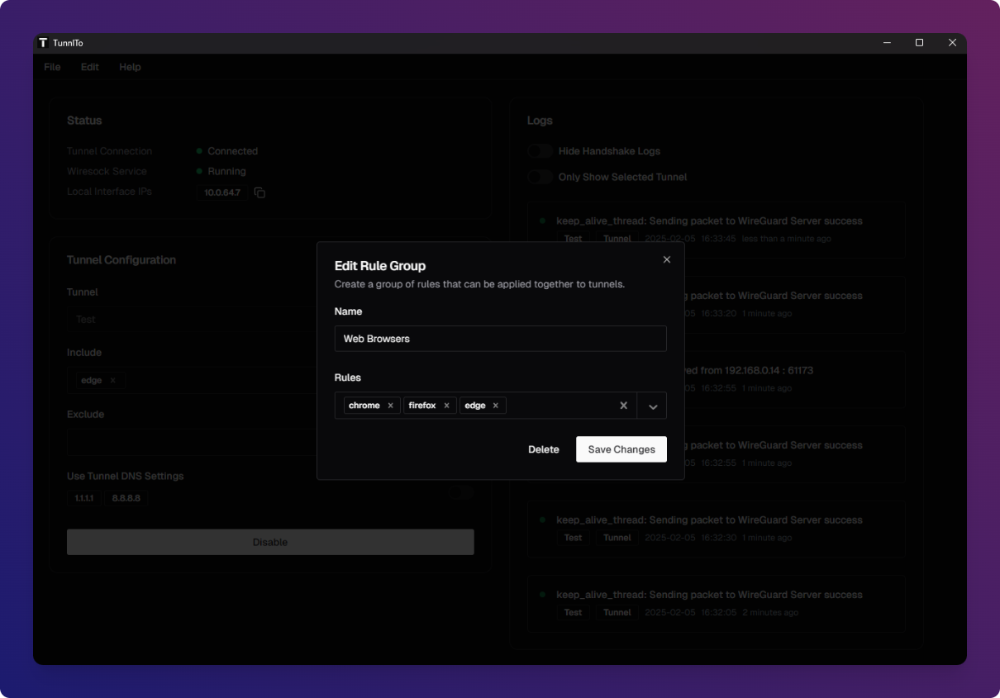
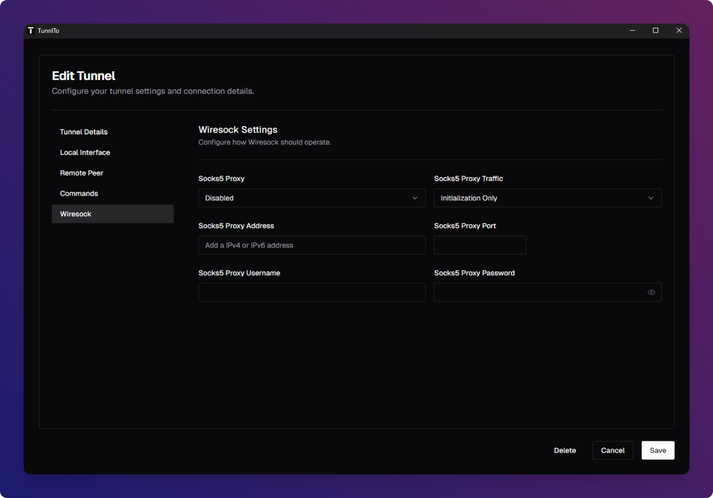
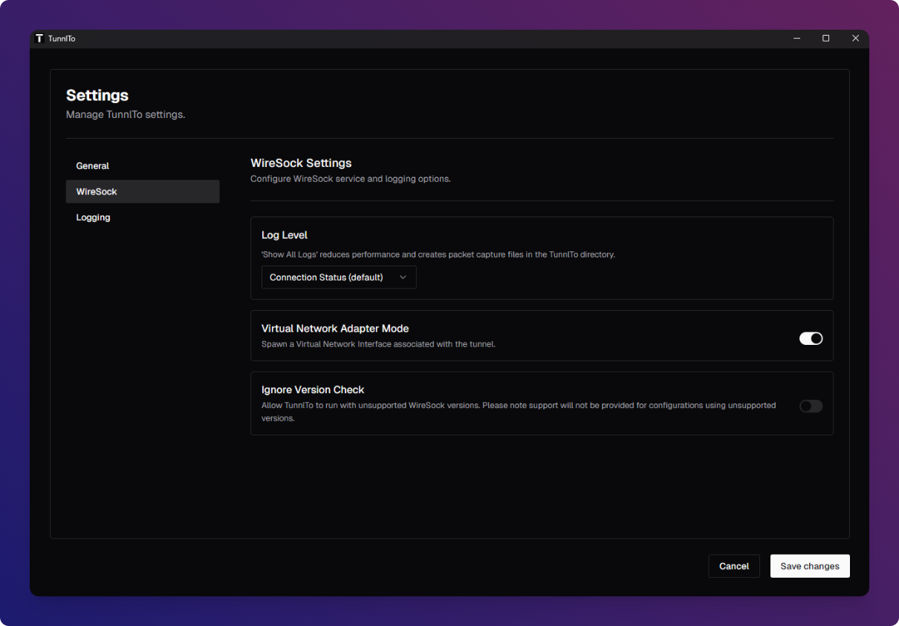

# TunnlTo
_A powerful WireGuard client for Windows with advanced split tunneling and an intuitive, user-friendly interface._

## Website
- [Visit the TunnlTo Website](https://tunnl.to)

## Follow For Updates
Please follow the project on Twitter to be notified of new releases and updates.
- [Follow TunnlTo on X](https://x.com/TunnlTo)

## Download
Download for Windows 10/11 on the [Releases](https://github.com/TunnlTo/desktop-app/releases) page.

## What does TunnlTo do?
TunnlTo seamlessly integrates with the powerful [Wiresock](https://wiresock.net) WireGuard client to let you precisely control which Windows applications, processes, and IP addresses can or cannot use a WireGuard VPN tunnel.

## Example use cases

### Privacy
- Route only FireFox through a privacy VPN
- Route a specific IP address range through a privacy VPN
- Route all traffic through a privacy VPN except a local IP address range

### Work
- Route Slack and Microsoft Office through a work VPN
- Stop a browser from routing through a work VPN

### Gaming
- Route a game through a gaming VPN
- Stop a game from routing through a privacy VPN
- Route all games within the Steam folder through a VPN
- Route all traffic through a VPN except applications within a folder

### Support
- Create an issue or visit the [Discussion Thread](https://github.com/TunnlTo/desktop-app/discussions/249)

### Screenshots

