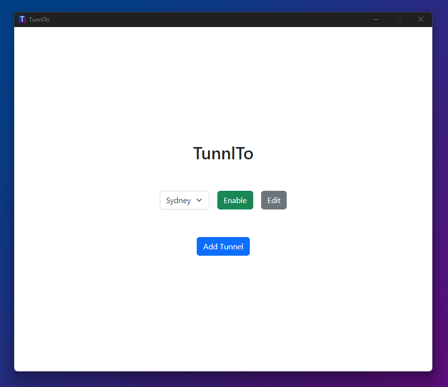
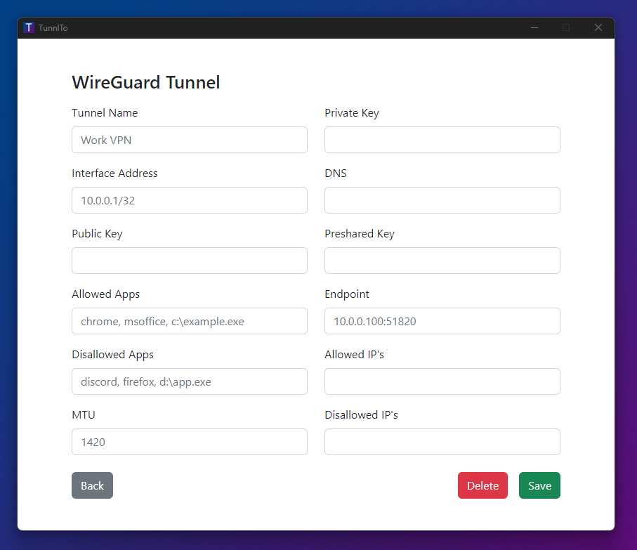

 

  

  <h2 align="center">TunnlTo</h2>

  

    <b>TunnlTo is a lightweight, fast, Windows WireGuard VPN client built for split tunneling.</b>
     
  

  
   
   
  
   
   
  
  The gif demonstrates TunnlTo routing Edge Browser through a WireGuard VPN tunnel without affecting Chrome Browser. Edge's IP changes, Chrome's does not.
  
   

## What does this application do?
TunnlTo is a tool for controlling which Windows applications, processes, and IP addresses can use a WireGuard VPN tunnel.

### Example use cases
* Route only FireFox through a privacy VPN
* Route Slack and Microsoft Office through a work VPN
* Route a game through a gaming VPN
* Stop a game from routing through a privacy VPN
* Stop a browser from routing through a work VPN
* Route a specific IP address range through a privacy VPN
* Route all traffic through a privacy VPN except a specific IP address range

## How does it work?
TunnlTo is built in collaboration with the creator of [WireSock](https://www.wiresock.net/). WireSock is currently closed source but an open source version is being considered.

> WireSock VPN Client is a lightweight command line WireGuard VPN client for Windows that has advanced features not available in the official WireGuard for Windows such as selective application tunneling and disallowed IP addresses.
>
>WireSock VPN Client combines the power of Windows Packet Filter and BoringTun (user space WireGuard implementation in Rust) to provide exceptional performance, security and scalability.

## Performance
|| Download | Upload |
| :---         |     ---:      |          ---: |
| **WireGuard Official** | 719 Mbps | **892** Mbps |
| **TunnlTo** | **892** Mbps | 879 Mbps |
| **TunSafe** | 284 Mbps | 435 Mbps |

## Prerequisites
* A basic understanding of WireGuard
* Access to a WireGuard server
* Windows 10/11

## Follow For Updates
Please follow the project on Twitter to be notified of new releases and updates.
* [Twitter](https://twitter.com/TunnlTo)

## Get started
Visit the [releases](https://github.com/TunnlTo/desktop-app/releases) page to download the installer for the latest version.

---

# Documentation
Both IPv4 and IPv6 are supported.

## Configuration Parameters

### Tunnel Name
The description of your WireGuard tunnel.
- Required
- Example: `Work VPN`

### Private Key
The private key for the WireGuard tunnel.
- Required

### Public Key
The Public Key for the WireGuard tunnel.

- Required

### Preshared Key
The Preshared Key for the WireGuard tunnel.

- Optional

### Interface Address
The interface address for the WireGuard tunnel.

- Required
- Example: `10.0.64.1/32`

### Endpoint
The endpoint for the WireGuard server.

- Required
- Example: `100.100.100.100:54236`

### DNS
The DNS server to use for the WireGuard tunnel.

- Optional
- If left blank, the default DNS server will be used.
- Use a comma to separate multiple DNS servers
- Example: `1.1.1.1, 8.8.8.8`

### Allowed Apps
The list of applications that can use the WireGuard tunnel.

- Optional
- If left blank, all applications will be allowed.
- Use a comma to separate multiple applications.
- If this parameter is used, the Allowed IP's parameter must also be set.
- Use the full path to the executable or list the process name without the .exe extension, for example:
  - `C:\Program Files (x86)\Google\Chrome\Application\chrome.exe` 
  - `chrome, msoffice, firefox`

### Disallowed Apps
The list of applications that cannot use the WireGuard tunnel.

- Optional
- AllowedApps takes precedence, and if both are specified, then AllowedApps is matched first.
- Use a comma to separate multiple applications.
- Use the full path to the executable or list the process name without the .exe extension, for example:
  - `C:\Program Files (x86)\Google\Chrome\Application\chrome.exe` 
  - `chrome, msoffice, firefox`

### Allowed IP's
The list of IP addresses and IP ranges that can use the WireGuard tunnel.

- Optional
- Default: `0.0.0.0/0`
- Example: `1.1.1.1, 192.168.1.0/24`
- Use a comma to separate multiple IP addresses and IP ranges.
- If the Allowed Apps parameter is set, this will forward all the listed IP addresses and IP ranges used by the Allowed Apps through the tunnel.

### Disallowed IP's
The list of IP addresses and IP ranges that cannot use the WireGuard tunnel.

- Optional
- Example: `1.1.1.1, 192.168.1.0/24`
- Use a comma to separate multiple IP addresses and IP ranges.
- If the Allowed Apps parameter is set, this will block all the listed IP addresses and IP ranges used by the Allowed Apps from using the tunnel.

### MTU
The MTU for the WireGuard tunnel.

- Optional
- Default: `1420`

---

# Example Configurations
These examples show the use of optional parameters. The required parameters such as private key, public key etc. are not shown. If you would like an example added, please open a [discussion](https://github.com/TunnlTo/desktop-app/discussions).

## Route a specific app through a tunnel
### Scenario
You utilise a privacy VPN to protect your privacy when browsing the internet. You want to use the privacy VPN when browsing the internet with FireFox and when torrenting, but you do not want to use the privacy VPN for any other applications.

### Expected Outcome
In this example, FireFox and qBittorrent are routed through the WireGuard tunnel while all other applications are routed through the default network adapter. DNS requests from FireFox and qBittorrent will route through the tunnel and use the DNS servers specified.

### Configuration
- DNS: `1.1.1.1, 8.8.8.8`
- Allowed Apps: `firefox, qBittorrent`
- Allowed IP's: `0.0.0.0/0`

## Route all traffic through a tunnel except specific apps
### Scenario
You utilise a company VPN to access your employers servers. You want the Chrome browser traffic to route through your default network adapter so it will:
- Not be tracked by your employer
- Not overload the company VPN bandwidth when watching videos, downloading files etc.

### Expected Outcome
In this example, all traffic is routed through the WireGuard tunnel except Chrome.

### Configuration
- DNS: `1.1.1.1, 8.8.8.8`
- Disallowed Apps: `chrome`
- Allowed IP's: `0.0.0.0/0`

## Route a specific IP address range when used by a specific app through a tunnel
### Scenario
You want to access a company intranet when using the Edge browser, otherwise it should use your normal network adapter.

### Expected Outcome
In this example, an IP address range is routed through the WireGuard tunnel when the the IP range is accessed by the Edge browser. Otherwise, all Edge browser traffic is routed through the default network adapter. Note that in this example the DNS parameter is not set, so the default DNS server will be used by Edge. If the DNS parameter was set to the company DNS server, all Edge DNS requests would route through the tunnel to the company DNS server.

### Configuration
- Allowed Apps: `C:\Program Files (x86)\Microsoft\Edge\Application\msedge.exe`
- Allowed IP's: `10.0.0.0/64`

## Route a specific IP address and/or IP address range through a tunnel
### Scenario
You want to access company servers through a company VPN server, however all other traffic should use your default network adapter.

### Expected Outcome
In this example, an IP address and IP range are routed through the WireGuard tunnel for all applications. All other traffic is routed through the default network adapter.

### Configuration
- Allowed IP's: `200.200.200.200, 10.10.10.0/24`

## Disallow a specific IP address and IP address range from using a tunnel
### Scenario
You want to use a privacy VPN service for all network traffic except some specific IP addresses and IP address ranges.

### Expected Outcome
In this example, an IP address and IP range are routed through the default network adapter and NOT the tunnel. All other traffic is routed through the WireGuard tunnel.

### Configuration
- Allowed IP's: `0.0.0.0/0`
- Disallowed IP's: `200.200.200.200, 10.10.10.0/24`

## Route a specific app through a tunnel except for a specific IP address range
### Scenario
You utilise an overseas VPN server for faster ping times to an overseas region in Counter Strike. You also still play on local servers and do not want to have to enable/disable the VPN depending on what servers you're playing on.

### Expected Outcome
Counter Strike traffic is routed through the WireGuard tunnel except for when a specific IP address range is accessed by the game. In this case the IP range would be the local servers.

### Configuration
- Allowed Apps: `csgo`
- Allowed IP's: `0.0.0.0/0`
- Disallowed IP's: `12.34.45.0/24`

---

# Issues and Suggestions
Please use [issues](https://github.com/TunnlTo/desktop-app/issues) for any problems you may encounter and [discussions](https://github.com/TunnlTo/desktop-app/discussions) for any suggestions, ideas or feature requests you may have.

# Built With
* WireSock
* WireGuard
* Tauri
* Rust, HTML, CSS (Bootstrap), JavaScript

# License
Copyright (c) 2022 TunnlTo. TunnlTo is not currently licensed.

# Acknowledgments

* [WireSock](https://www.wiresock.net/) and its creator [Vadim Smirnov](https://www.ntkernel.com/)
* [WireGuard](https://www.wireguard.com/)
* [Tauri](https://tauri.app/)