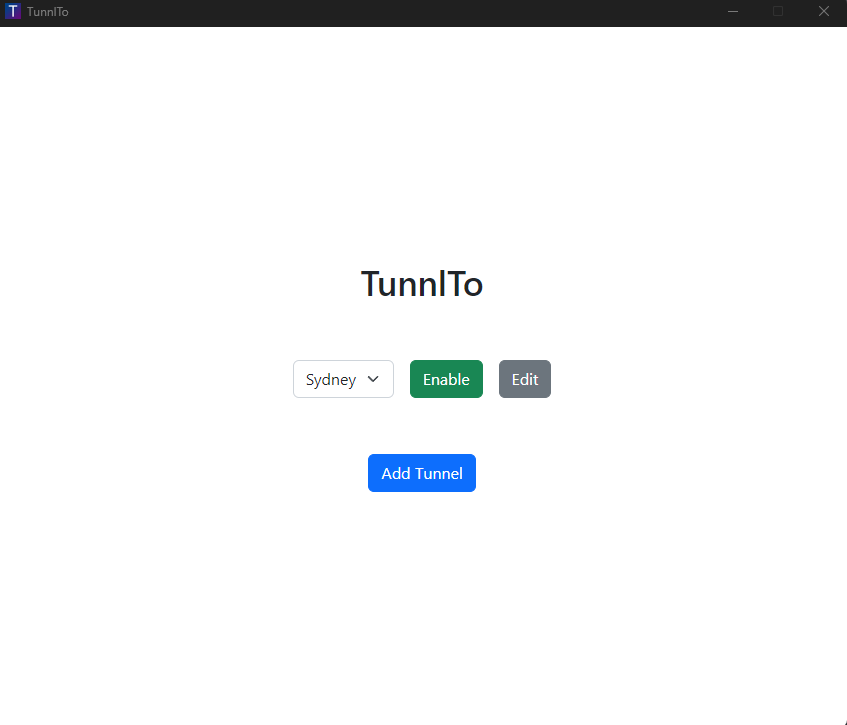
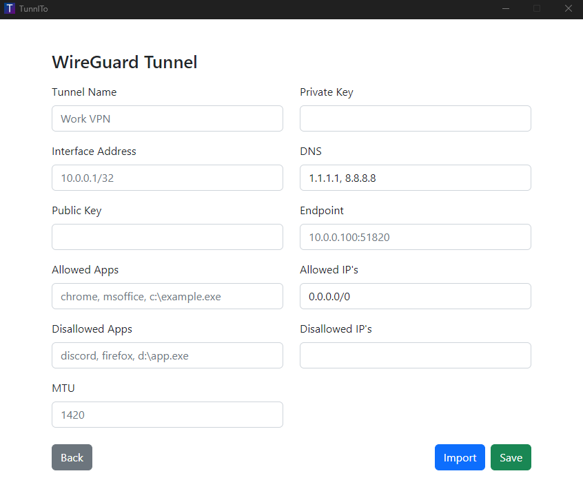

 

  

  <h2 align="center">TunnlTo</h2>

  

    TunnlTo is a lightweight, fast, Windows WireGuard VPN client built for split tunneling.
     
  

  
   
   
  
   

### What does this application do?
Routes the network traffic of selected Windows applications through a WireGuard tunnel while leaving the network traffic of any other applications to route through your normal internet connection.

For example:
* Route only FireFox through a privacy VPN
* Route Slack and Microsoft Office through a work VPN
* Route a game through a gaming VPN 

### How does it work?
TunnlTo is built in collaboration with the creator of [WireSock](https://www.wiresock.net/). WireSock is currently closed source but work is being done to make it open.

> WireSock VPN Client is a lightweight command line WireGuard VPN client for Windows that has advanced features not available in the official WireGuard for Windows such as selective application tunneling and disallowed IP addresses.
>
>WireSock VPN Client combines the power of Windows Packet Filter and BoringTun (user space WireGuard implementation in Rust) to provide exceptional performance, security and scalability.

### Release status
While the underlying WireSock tool is stable and production ready, TunnlTo is in early development and we are looking for testers. If you have any problems please open an issue in this GitHub repo. 

### Prerequisites
* A basic understanding of WireGuard
* Access to a WireGuard server
* Windows 10/11

### Get started
Visit the [releases](https://github.com/TunnlTo/desktop-app/releases) page to download the installer for the latest version. 

## Built With
* WireSock
* WireGuard
* Tauri
* HTML, CSS (Bootstrap), JavaScript

## License
Copyright (c) 2022 TunnlTo. TunnlTo is not currently licensed.

## Acknowledgments

* [WireSock](https://www.wiresock.net/) and its creator [Vadim Smirnov](https://www.ntkernel.com/)
* [WireGuard](https://www.wireguard.com/)
* [Tauri](https://tauri.app/)