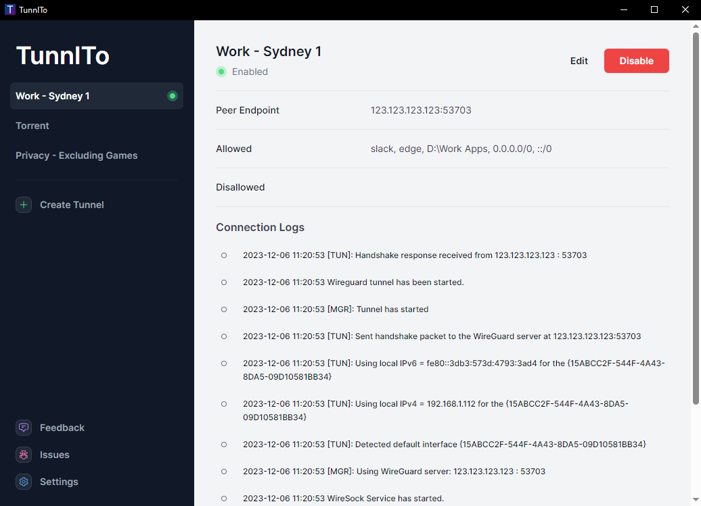
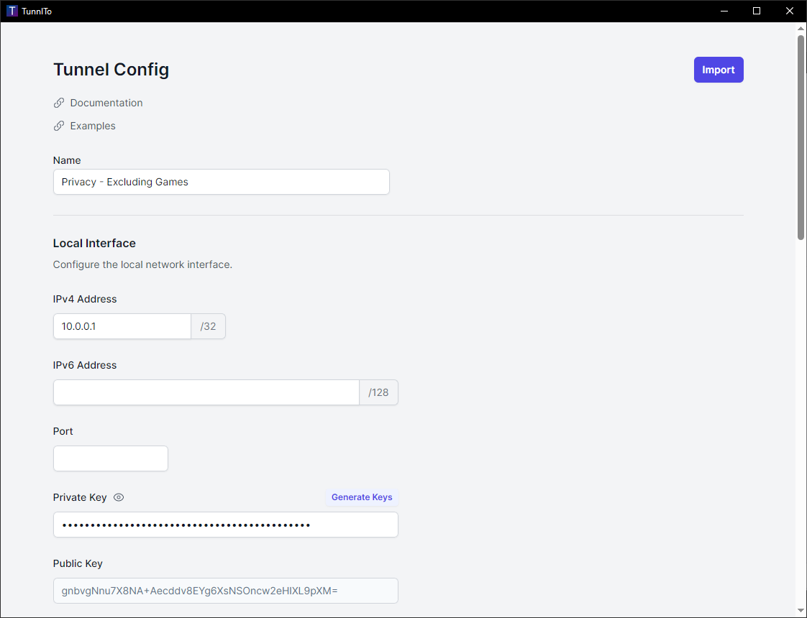
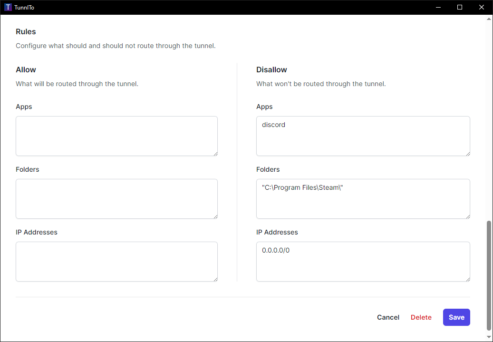
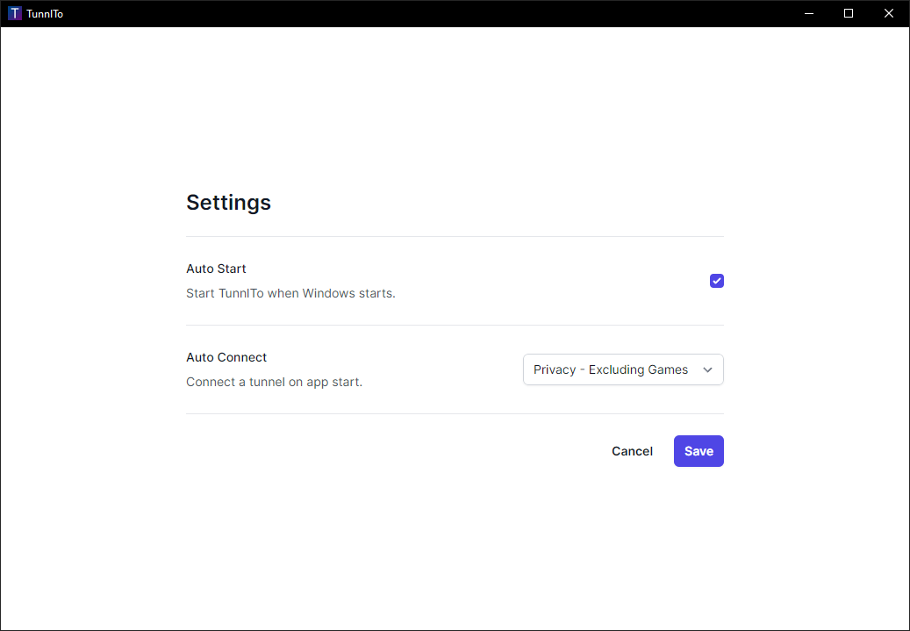
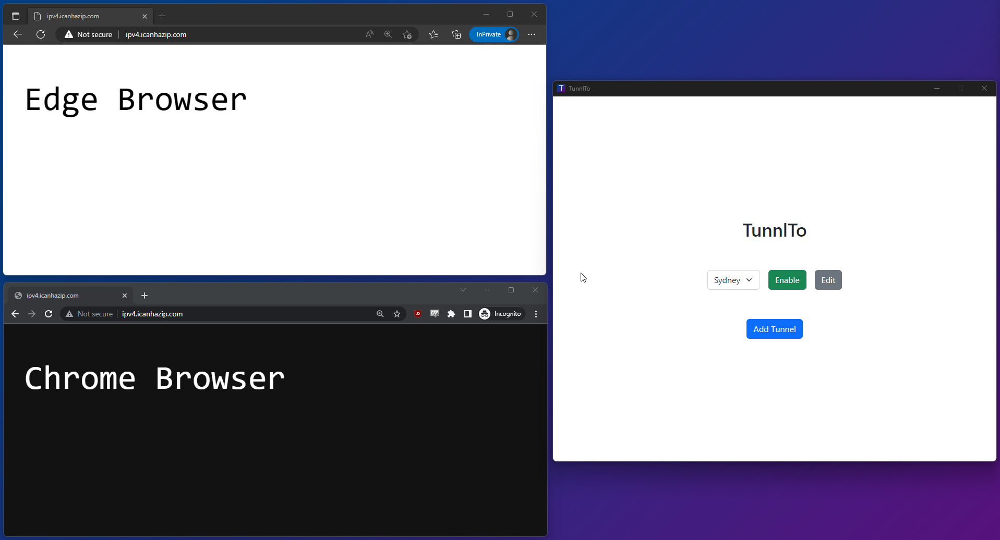

 

  

  <h1 align="center">TunnlTo</h1>

  

    <i><b>TunnlTo is a WireGuard VPN split tunneling client for Windows.</b></i>
     
  

  
   
   
  
   
   
    
   
   
    
   
   
  
  The gif demonstrates TunnlTo routing Edge Browser through a WireGuard VPN tunnel without affecting Chrome Browser. Edge's IP changes, Chrome's does not.
  
   

## What does this application do?

TunnlTo is a tool for controlling which Windows applications, processes, and IP addresses can use a WireGuard VPN tunnel.

## Example use cases

- Route only FireFox through a privacy VPN
- Route Slack and Microsoft Office through a work VPN
- Route a game through a gaming VPN
- Stop a game from routing through a privacy VPN
- Stop a browser from routing through a work VPN
- Route a specific IP address range through a privacy VPN
- Route all traffic through a privacy VPN except a specific IP address range
- Route all applications within a folder through a VPN
- Route all traffic through a VPN except applications within a folder

## How does it work?

TunnlTo is built in collaboration with the creator of [WireSock](https://www.wiresock.net/). TunnlTo 'wraps' the WireSock CLI application to provide a simple user interface for enhanced accessibility. WireSock is currently closed source and an open source version is being considered.

> WireSock VPN Client is a lightweight command line WireGuard VPN client for Windows that has advanced features not available in the official WireGuard for Windows such as selective application tunneling and disallowed IP addresses.
>
> WireSock VPN Client combines the power of Windows Packet Filter and BoringTun (user space WireGuard implementation in Rust) to provide exceptional performance, security and scalability.

## Performance

|                        |     Download |       Upload |
| :--------------------- | -----------: | -----------: |
| **WireGuard Official** |     719 Mbps | **892** Mbps |
| **TunnlTo**            | **892** Mbps |     879 Mbps |
| **TunSafe**            |     284 Mbps |     435 Mbps |

## Prerequisites

- A basic understanding of WireGuard
- Access to a WireGuard server
- Windows 10/11

## Follow For Updates

Please follow the project on Twitter to be notified of new releases and updates.

- [Twitter](https://twitter.com/TunnlTo)

## Get started

Visit the [releases](https://github.com/TunnlTo/desktop-app/releases) page to download the installer for the latest version.

## Feature Requests

To request a feature, visit the [feature request discussion](https://github.com/TunnlTo/desktop-app/discussions/130).

## Issues and Suggestions

Please use [issues](https://github.com/TunnlTo/desktop-app/issues) for any problems you may encounter and [discussions](https://github.com/TunnlTo/desktop-app/discussions) for any suggestions, ideas or feature requests you may have.
  

---
 

# Tunnel Config

### Tunnel Name

The description of your WireGuard tunnel.

- Required parameter.

**Example**

- `Work VPN`

## Local Interface

### IPv4 Address

The local interface IPv4 address.

- At least one IPv4 or IPv6 Address is required.

**Example**

- `10.0.0.1`

### IPv6 Address

The local interface IPv6 address.

- At least one IPv4 or IPv6 Address is required.

**Example**

- `662a:622d:33aa:6ad0:adba:865f:d13c:85f1`

### Port

The local interface port.

- If nothing is set, the port will be automatically assigned.

**Example**

- `54236`

### Private Key

The private key for the local interface.

- Required parameter.

### Public Key

The public key for the local interface.

- Automatically derived from the local interface private key.

### DNS

When a DNS address is configured, it becomes the universal destination for all DNS requests across all applications (including those not in the allow list). In the absence of a specific DNS setting, the systems default DNS is employed as the global resolver for all applications.

For further understanding of how this works, please see the examples listed further down on this page.

- If set, becomes the DNS for all applications (including any applications not configured to route through the tunnel).
- If left blank, the systems default DNS server will be used.
- Use a comma to separate multiple DNS servers.

**Example**

- `1.1.1.1, 8.8.8.8`

### MTU

The MTU (Maximum Transmission Unit) for the tunnel.

- If left blank, the default size of 1420 is used.

**Example**

- `1380`

## Remote Peer

### Endpoint

The address of the Wireguard endpoint.

- Required parameter.

### Port

The port of the Wireguard endpoint.

- Required parameter.

### Public Key

The Public key for the tunnel.

- Required parameter.

### Preshared Key

The Preshared key for the tunnel.

### Persistent Keep-Alive

The persistent keep-alive setting for the tunnel.

## Rules

### Allow Apps

The list of applications that can use the tunnel.

- If left blank, all applications will be allowed.
- Use a comma to separate multiple applications.
- If this parameter is used, the Allowed IP's parameter must also be set.

**Options**

- Use the full path to the executable
- List the process name without the .exe extension
- List the process name with the .exe extension

**Examples**

- `C:\Program Files (x86)\Google\Chrome\Application\chrome.exe`
- `chrome, msoffice, firefox`

### Allow Folders

The list of applications that can use the tunnel.

- Use a comma to separate multiple folders.
- If this parameter is used, the Allowed IP's parameter must also be set.

**Options**

- List a folder path (which should include at least one slash or backslash), and all executables within that folder and its subfolders will be included.

**Example**s

- `C:\Program Files (x86)`
- `D:\Work Apps\, C:\Program Files\Slack`

### Allow IP Addresses

The list of IP addresses and IP ranges that can use the tunnel.

- Use a comma to separate multiple IP addresses and IP ranges.
- If the Allowed Apps parameter is set, this will forward all the listed IP addresses and IP ranges used by the Allowed Apps through the tunnel.

**Example**

- `0.0.0.0/0, ::/0`
- `192.168.1.0/24, 662a:622d:33aa:6ad0:adba:865f:d13c:85f1, 1.1.1.1`

### Disallow Apps

Apps that cannot use the tunnel.

- Allowed Apps takes precedence, and if both are specified, then Allowed Apps is matched first.
- Use a comma to separate multiple applications.

**Options**

- Use the full path to the executable
- List the process name without the .exe extension
- List the process name with the .exe extension

**Examples**

- `C:\Program Files (x86)\Google\Chrome\Application\chrome.exe`
- `chrome, msoffice,`
- `firefox.exe`

### Disallow Folders

The folders containing apps that cannot use the tunnel.

- Allowed Folders takes precedence, and if both are specified, then Allowed Apps is matched first.
- Use a comma to separate multiple folders.

**Options**

- List a folder path (which should include at least one slash or backslash), and all executables within that folder and its subfolders will be excluded.

**Example**

- `C:\Program Files (x86)`
- `D:\Work Apps, C:\Program Files\Slack`

### Disallow IP Addresses

The IP addresses and IP ranges that cannot use the tunnel.

- Use a comma to separate multiple IP addresses and IP ranges.
- If the Allowed Apps parameter is set, this will block all the listed IP addresses and IP ranges used by the Allowed Apps from using the tunnel.

**Example**

- `1.1.1.1, 192.168.1.0/24`
  

---
 

# Example Configurations

These examples show the use of optional parameters. The required parameters such as private key, public key etc. are not shown. If you would like an example added, please open a [discussion](https://github.com/TunnlTo/desktop-app/discussions).

## Route a specific app through a tunnel

### Scenario

You utilise a privacy VPN to protect your privacy when browsing the internet. You want to use the privacy VPN when browsing the internet with FireFox and when torrenting, but you do not want to use the privacy VPN for any other applications.

### Expected Outcome

In this example, FireFox and qBittorrent are routed through the tunnel while all other applications are routed through the default network adapter. All application (not just firefox and qBittorrent) DNS requests will route through the tunnel to the configured DNS servers.

### Configuration

- DNS: `1.1.1.1, 8.8.8.8`
- Allowed Apps: `firefox, qBittorrent`
- Allowed IP's: `0.0.0.0/0`

## Route all traffic through a tunnel except specific apps

### Scenario

You utilise a company VPN to access your employers servers. You want the Chrome browser traffic to route through your default network adapter so it will:

- Not be tracked by your employer
- Not overload the company VPN bandwidth when watching videos, downloading files etc.

### Expected Outcome

In this example, all traffic is routed through the tunnel except Chrome. All application (not just chrome) DNS requests will route through the tunnel to the configured DNS servers.

### Configuration

- DNS: `1.1.1.1, 8.8.8.8`
- Disallowed Apps: `chrome`
- Allowed IP's: `0.0.0.0/0`

## Route all apps in a specific folder through a tunnel

### Scenario

You utilise a company VPN to access your employers servers. You want all of your work applications that are installed in a specific folder to route through your company VPN so that they:

- Work correctly with your companies servers
- Follows your company policies

### Expected Outcome

In this example, all apps in the `C:\Work Apps` folder are routed through the tunnel. The company DNS server is used for DNS requests for all applications (not just `D:\Work Apps`).

### Configuration

- DNS: `10.64.0.1`
- Allowed Apps: `D:\Work Apps`
- Allowed IP's: `0.0.0.0/0`

## Route a specific IP address range when used by a specific app through a tunnel

### Scenario

You want to access a company intranet when using the Edge browser, otherwise it should use your normal network adapter.

### Expected Outcome

In this example, an IP address range is routed through the tunnel when the the IP range is accessed by the Edge browser. Otherwise, all Edge browser traffic is routed through the default network adapter. Note that in this example the DNS parameter is not set, so the default DNS server will be used by Edge. If the DNS parameter was set to the company DNS server, all  DNS requests would route through the tunnel to the company DNS server.

### Configuration

- Allowed Apps: `C:\Program Files (x86)\Microsoft\Edge\Application\msedge.exe`
- Allowed IP's: `10.0.0.0/64`

## Route a specific IP address and/or IP address range through a tunnel

### Scenario

You want to access company servers through a company VPN server, however all other traffic should use your default network adapter.

### Expected Outcome

In this example, a specific IP address and IP range are routed through the tunnel for all applications. All other traffic is routed through the default network adapter.

### Configuration

- Allowed IP's: `200.200.200.200, 10.10.10.0/24`

## Disallow a specific IP address and IP address range from using a tunnel

### Scenario

You want to use a privacy VPN service for all network traffic except some specific IP addresses and IP address ranges.

### Expected Outcome

In this example, a specific IP address and IP range are routed through the default network adapter and NOT the tunnel. All other traffic is routed through the tunnel.

### Configuration

- Allowed IP's: `0.0.0.0/0`
- Disallowed IP's: `200.200.200.200, 10.10.10.0/24`

## Route a specific app through a tunnel except for a specific IP address range

### Scenario

You utilise an overseas VPN server for faster ping times to an overseas region in Counter Strike. You also still play on local servers and do not want to have to enable/disable the VPN depending on what servers you're playing on.

### Expected Outcome

Counter Strike traffic is routed through the tunnel except for when a specific IP address range is accessed by the game. In this case the IP range are local servers.

### Configuration

- Allowed Apps: `csgo`
- Allowed IP's: `0.0.0.0/0`
- Disallowed IP's: `12.34.45.0/24`
  

---
 

# Built With

- WireSock
- WireGuard
- Tauri
- Rust, TypeScript, React, TailwindCSS

# License

Copyright (c) 2023 TunnlTo. TunnlTo inherits licensing from WireSock. TunnlTo is free for personal (non-commercial), or educational (including non-profit organization) use. For commercial use, please contact us for licensing options.

# Acknowledgments

- [WireSock](https://www.wiresock.net/) and its creator [Vadim Smirnov](https://www.ntkernel.com/)
- [WireGuard](https://www.wireguard.com/)
- [Tauri](https://tauri.app/)
